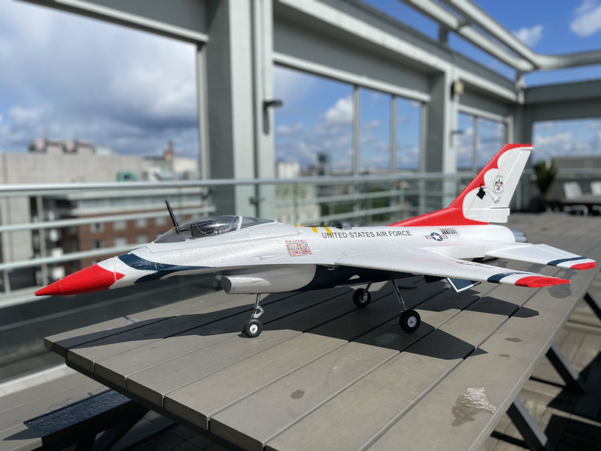

# F16Capstone
<!-- PROJECT LOGO -->
 

  

  <h3 align="center">F-16 Capstone: Modeling and Simulation</h3>

  

   The objective of this project is to develop a dynamic model of a scaled-down Radio Controlled F-16 Falcon jet and perform flight simulation as well as a real flight.
     
    <a href="https://github.com/camdeno/F16Capstone"><strong>Explore the docs »</strong></a>
     
     
    <a href="https://github.com/camdeno/F16Capstone/tree/main/Mathematical%20Model/Matlab%20Script">Nonlinear Model Script</a>
    <a href="https://github.com/camdeno/F16Capstone/tree/main/Testing%20Documentation">Testing Documentation</a>
    <a href="https://github.com/camdeno/F16Capstone/issues">Report Bug</a>
  

Team 5 Capstone git for the F16 Modeling and Simulation. Winter/Spring 2020-2021.

The objective of this project is to develop a dynamic model of a scaled-down Radio Controlled F-16 Falcon jet and perform flight simulation as well as a real flight. Galois, the industry sponsor, plans to use models to circumvent the inconvenience of flight testing real aircraft. This project is open-source, so the Cyber-Physical System Research Community and some hobbyists can also use the data and information our team collects for flight simulation. In this project, our team needs to use the supplied Pixhawk software stack to determine the flight dynamics of a small-scale model RC F-16 aircraft and develop trusted flight control software.

